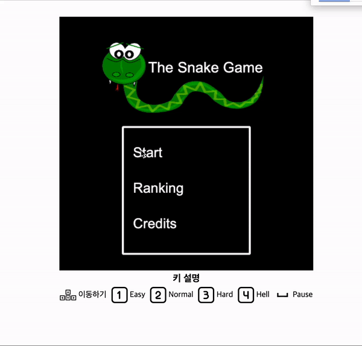

# Snake Game

#### Front - Vanilla js
#### Backend - Express

### 1.5x speed play video

```
npm i
npm run dev
```

- keydown handling
  - when the user presses a key with a function
  - javascript handles state
- mouse position
  - change cursor if mouse position x,y on button
- canvas
  - game created by html canvas object

- level system
  - level up every 5 points

- ranking system
  - get data from `public/data/ranking.json`
  - if result greater than the ranking data
  - post data using express
  - and modify `public/data/ranking.json`

